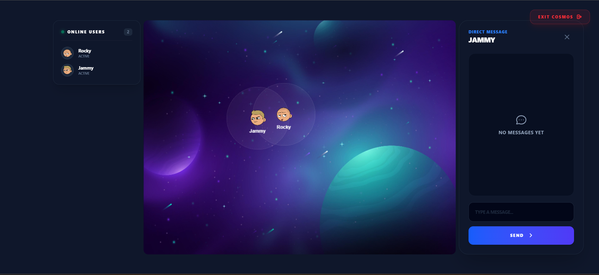

# 🌌 Virtual Cosmos

A real-time multiplayer virtual interaction space where users can join with their name and avatar, move around a shared cosmic environment, and chat with nearby users using proximity-based messaging.

Built as a full-stack real-time web application using React, PixiJS, Node.js, Socket.IO, and MongoDB.



🎬 **[Watch the Demo Video](https://youtu.be/_0cFtmKbqMk)**

---

## 🚀 Features

* **Dynamic Multiplayer Space**
  Join the world in seconds with a fast, name-based onboarding process.

* **Dice-Shuffle Avatar System**
  Generate infinite unique characters with a single click using our dynamic Dice Shuffle system. Powered by the `@dicebear/adventurer` library.

* **Exit & Persistence**
  Safely leave the environment using the premium "Exit Cosmos" button. The backend ensures your state is cleaned up instantly for all other users.

* **Real-Time Player Movement**
  Smooth, low-latency player synchronization across all connected clients using WebSocket communication.

* **Proximity-Based Interaction**
  Experience social immersion—chat panels and interactive prompts only appear when you move within a specific radius of another player.

* **Dynamic UI & Glassmorphism**
  A state-of-the-art interface built with Tailwind CSS v4, featuring frosted glass elements, premium gradients, and smooth micro-animations.

* **Live Chat & Speech Bubbles**
  Real-time messages are visible both in the global chat thread and as dynamic speech bubbles that follow your character's movement.

* **MongoDB Synchronization**
  Persistent storage of user session data, active status, and world coordinates.

---

## 🛠 Tech Stack

### Frontend
- **Framework**: React 19 (Vite)
- **Engine**: PixiJS 8 (High-performance 2D rendering)
- **Styling**: Tailwind CSS v4 + Vanilla CSS
- **Assets**: DiceBear API (Dynamic Avatars)
- **Networking**: Socket.IO Client

### Backend
- **Runtime**: Node.js + Express
- **Real-time**: Socket.IO
- **Database**: MongoDB (Mongoose ODM)
- **Environment**: Dotenv

---

## ⚙️ How It Works

1. **Onboarding**: Users shuffle for an avatar and enter a nickname on the Join Screen.
2. **Guidelines**: A dedicated interaction guide explains movement controls and communication shortcuts.
3. **Session Creation**: The backend registers the user and broadcasts their entry via `playersUpdate`.
4. **Movement**: Frontend listens for arrow keys/WASD and emits `playerMove`.
5. **Proximity**: The `Canvas` calculates distances; if $<80px$, the "Press E to chat" prompt appears.
6. **Messaging**: `sendMessage` payloads are routed through the server to specific targets or self-synchronized.
7. **Cleanup**: Disconnecting or clicking "Exit" triggers a world-wide cleanup of that character's data.

---

## 📦 Installation

To get the Cosmos running on your machine:

### 1. Backend Server
```bash
cd backend
npm install
node server.js
```

### 2. Frontend Client
```bash
cd frontend
npm install
npm run dev
```

---

## 🌐 Environment Variables

Create a `.env` file in the `/backend` directory:
```env
MONGO_URI=your_mongodb_connection_string
PORT=5000
```

---

## 🔮 Future Improvements
- [ ] P2P Encrypted Messaging
- [ ] Private Room Channels
- [ ] Emoji Reacts & emotes
- [ ] World persistence (saved messages)
- [ ] Mobile-responsive touch controls
- [ ] Character customization (clothes/hair)
